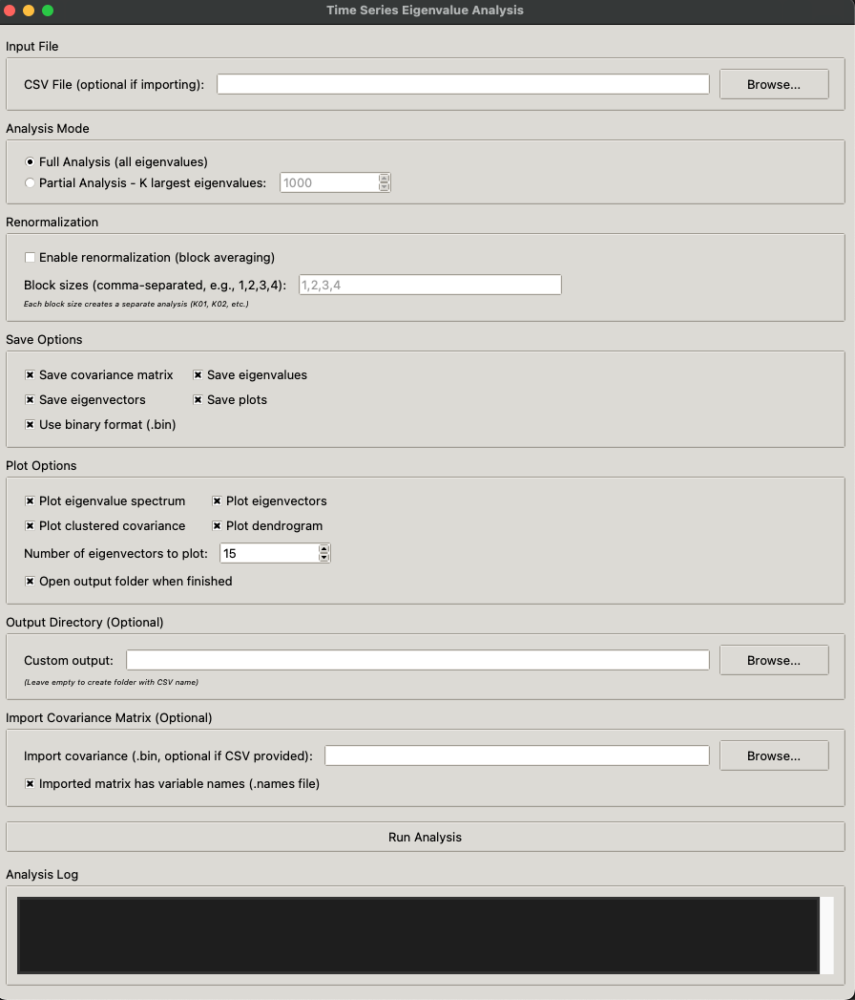

# Time Series Eigenvalue Analysis

<p align="center">
  
  &nbsp;&nbsp;&nbsp;&nbsp;
  
</p>

<p align="center">
  <em>Developed at the Center for Complexity Sciences (C3), UNAM, Mexico</em>
</p>

[](https://www.python.org/downloads/)
[](https://opensource.org/licenses/MIT)


Modular package for eigenvalue analysis of time series with support for renormalization and hierarchical clustering.

## Package Structure

```
timeseries_analysis/
├── __init__.py                      # Package initialization
├── cli.py                           # Command-line interface
├── gui.py                           # Graphical interface
├── covariance.py                    # Covariance matrix computation
├── eigenanalysis.py                 # Eigenvalue analysis (C calls)
├── renormalization.py               # Matrix renormalization
├── clustering.py                    # Hierarchical clustering
├── statistics.py                    # Statistical analysis (variance, power law)
├── visualization.py                 # Visualization functions
├── io_utils.py                      # Input/output utilities
├── eigen_from_cov.c                 # C program for full eigenvalues
├── eigen_from_cov_partial.c         # C program for K largest eigenvalues
├── timeseries_eigen_analysis.py    # Main CLI script
└── gui_launcher.py                  # GUI launcher
```

## Installation

1. Clone the repository:
```bash
git clone https://github.com/tu-usuario/timeseries-eigenvalue-analysis.git
cd timeseries-eigenvalue-analysis
```

2. Install Python dependencies:
```bash
pip install -r requirements.txt
```

3. Compile C programs (see [Compiling C Programs](#compiling-c-programs) section)

## Compiling C Programs

**IMPORTANT**: The C executables must be compiled on the system where you will run the analysis. Executables compiled on one operating system (e.g., macOS) will not work on another (e.g., Linux).

### Prerequisites

You need LAPACK and BLAS libraries installed. The compilation command varies by system:

#### Linux (Ubuntu/Debian)
```bash
# If needed, install development libraries
sudo apt-get install liblapack-dev libblas-dev

# Compile
cd timeseries_analysis/
gcc -o eigen_from_cov eigen_from_cov.c -llapack -lblas -lm
gcc -o eigen_from_cov_partial eigen_from_cov_partial.c -llapack -lblas -lm
```

#### Linux (with FlexiBLAS - Fedora, RHEL, CentOS)
```bash
# FlexiBLAS is a modern wrapper for BLAS/LAPACK
cd timeseries_analysis/
gcc -o eigen_from_cov eigen_from_cov.c -lflexiblas -lm
gcc -o eigen_from_cov_partial eigen_from_cov_partial.c -lflexiblas -lm
```

#### Linux (with OpenBLAS)
```bash
# If your system uses OpenBLAS
cd timeseries_analysis/
gcc -o eigen_from_cov eigen_from_cov.c -lopenblas -lm
gcc -o eigen_from_cov_partial eigen_from_cov_partial.c -lopenblas -lm
```

#### macOS
```bash
# macOS comes with Accelerate framework (includes LAPACK/BLAS)
cd timeseries_analysis/
gcc -o eigen_from_cov eigen_from_cov.c -framework Accelerate
gcc -o eigen_from_cov_partial eigen_from_cov_partial.c -framework Accelerate
```

#### HPC Clusters (with Intel MKL)
```bash
# Load Intel modules
module load intel mkl  # or similar, depends on cluster

# Compile with MKL
cd timeseries_analysis/
gcc -o eigen_from_cov eigen_from_cov.c -lmkl_rt -lm
gcc -o eigen_from_cov_partial eigen_from_cov_partial.c -lmkl_rt -lm
```

### Verifying Compilation

After compilation, verify the executables were created correctly:

```bash
cd timeseries_analysis/
ls -lh eigen_from_cov eigen_from_cov_partial
file eigen_from_cov
```

The `file` command should show something like:
```
eigen_from_cov: ELF 64-bit LSB executable, x86-64...  # Linux
eigen_from_cov: Mach-O 64-bit executable x86_64       # macOS
```

### Troubleshooting Compilation

**Finding LAPACK/BLAS libraries on your system:**
```bash
# Linux
find /usr -name "*lapack*" 2>/dev/null | head -20
find /usr -name "*blas*" 2>/dev/null | head -20
ldconfig -p | grep -E 'lapack|blas'

# Check for specific implementations
ls /usr/lib64/*lapack* 2>/dev/null
ls /usr/lib64/*blas* 2>/dev/null
ls /usr/lib64/*openblas* 2>/dev/null
ls /usr/lib64/*flexiblas* 2>/dev/null
```

**If libraries are in non-standard locations:**
```bash
gcc -o eigen_from_cov eigen_from_cov.c -L/path/to/libs -llapack -lblas -lm
```

## Basic Usage

### 1. Graphical Interface

```bash
python gui_launcher.py
```
<p align="center">
  
</p>

### 2. Command Line

```bash
python timeseries_eigen_analysis.py [options] file.csv
```

---

## Terminal Usage Examples

### Example 1: Basic Full Analysis

Compute all eigenvalues of a time series and generate plots:

```bash
python timeseries_eigen_analysis.py data.csv --full
```

**Output:**
```
data_analysis/
└── K01/
    ├── data_eigenvalues_full.csv
    ├── data_eigenvectors_full.csv
    ├── spectrum_full.png
    ├── eigenvectors_full.png
    ├── covariance_clustered_*.png
    └── dendrogram.png
```

### Example 2: Partial Analysis (K largest eigenvalues)

Compute only the 100 largest eigenvalues:

```bash
python timeseries_eigen_analysis.py data.csv --K 100
```

**Output:**
```
data_analysis/
└── K01/
    ├── data_eigenvalues_K100.csv
    ├── data_eigenvectors_K100.csv
    ├── spectrum_K100.png
    └── eigenvectors_K100.png
```

### Example 3: Analysis with Renormalization

Perform analysis with multiple block sizes (1, 2, 3, 4):

```bash
python timeseries_eigen_analysis.py data.csv --full --block-sizes "1,2,3,4"
```

**Output:**
```
data_analysis/
├── K01/  # Original (no renormalization)
│   ├── spectrum_full.png
│   ├── eigenvectors_full.png
│   └── ...
├── K02/  # 2×2 blocks
│   ├── spectrum_full.png
│   ├── eigenvectors_full.png
│   └── ...
├── K03/  # 3×3 blocks
│   └── ...
└── K04/  # 4×4 blocks
    └── ...
```

### Example 4: Save Covariance Matrix

Save the covariance matrix in binary format:

```bash
python timeseries_eigen_analysis.py data.csv --full --save-cov
```

**Output:**
```
data_analysis/
└── K01/
    ├── covariance.bin
    ├── covariance.names
    ├── correlation.bin
    ├── correlation.names
    └── ...
```

### Example 5: Import Existing Covariance Matrix

Analyze a previously computed covariance matrix:

```bash
python timeseries_eigen_analysis.py --import-cov covariance.bin --full
```

**Note:** You don't need to provide the CSV file when importing a matrix.

### Example 6: Import Matrix without Variable Names

If the binary matrix doesn't have a `.names` file:

```bash
python timeseries_eigen_analysis.py --import-cov covariance.bin --no-names --full
```

### Example 7: Renormalization of Imported Matrix

Import a matrix and apply renormalization:

```bash
python timeseries_eigen_analysis.py --import-cov covariance.bin --full \
    --block-sizes "1,2,4,8"
```

### Example 8: Use CSV Format Instead of Binary

By default binary format is used for C communication, but you can use CSV:

```bash
python timeseries_eigen_analysis.py data.csv --full --use-csv
```

### Example 9: Quick Analysis Without Saving

Perform exploratory analysis without saving eigenvalues or plots:

```bash
python timeseries_eigen_analysis.py data.csv --full \
    --no-save-eigen --no-save-plots
```

Output appears only in the terminal.

### Example 10: Customize Plots

Control which plots are generated:

```bash
python timeseries_eigen_analysis.py data.csv --full \
    --no-plot-cov --no-plot-dendro \
    --n-eigvecs 5
```

Only generates spectrum and first 5 eigenvectors.

### Example 11: Custom Output Directory

Specify an output directory:

```bash
python timeseries_eigen_analysis.py data.csv --full \
    --output-dir /path/to/results
```

### Example 12: Show Plots Interactively

View plots in interactive windows (requires display):

```bash
python timeseries_eigen_analysis.py data.csv --full --show
```

### Example 13: Generate Only Covariance Matrix

To compute and save only the covariance matrix without eigenvalue analysis:

```bash
python timeseries_eigen_analysis.py data.csv \
    --save-cov \
    --no-save-eigen \
    --no-save-plots
```

**Note:** Eigenvalue computation still runs but results are not saved.

### Example 14: Disable Clustering Plots

To skip hierarchical clustering visualizations:

```bash
python timeseries_eigen_analysis.py data.csv --full \
    --no-plot-cov \
    --no-plot-dendro
```

---

## Systematic Analysis Examples

### Bash Script: Analyze Multiple Files

```bash
#!/bin/bash
# analyze_all.sh

# Analyze all CSV files in a directory
for file in data/*.csv; do
    echo "Analyzing $file..."
    python timeseries_eigen_analysis.py "$file" --full \
        --block-sizes "1,2,3,4"
done

echo "All analyses complete!"
```

Usage:
```bash
chmod +x analyze_all.sh
./analyze_all.sh
```

### Bash Script: Analysis with Different Configurations

```bash
#!/bin/bash
# systematic_analysis.sh

DATA_FILE="my_timeseries.csv"

# Full analysis
echo "=== Full Analysis ==="
python timeseries_eigen_analysis.py "$DATA_FILE" --full \
    --output-dir results/full_analysis

# Partial analysis with different K
for K in 50 100 200 500; do
    echo "=== Partial Analysis K=$K ==="
    python timeseries_eigen_analysis.py "$DATA_FILE" --K $K \
        --output-dir "results/partial_K${K}"
done

# Renormalization analysis
echo "=== Renormalization Analysis ==="
python timeseries_eigen_analysis.py "$DATA_FILE" --full \
    --block-sizes "1,2,4,8,16" \
    --output-dir results/renormalization
```

### Python Script: Programmatic Analysis

```python
#!/usr/bin/env python3
"""
systematic_analysis.py - Programmatic analysis of multiple configurations
"""

import os
import subprocess
from pathlib import Path

# Configuration
DATA_FILES = [
    "experiment1.csv",
    "experiment2.csv",
    "experiment3.csv"
]

BLOCK_SIZES = [1, 2, 3, 4, 5]
OUTPUT_BASE = "results"

# Create results directory
os.makedirs(OUTPUT_BASE, exist_ok=True)

# Analyze each file
for data_file in DATA_FILES:
    if not os.path.exists(data_file):
        print(f"Warning: {data_file} not found, skipping...")
        continue
    
    base_name = Path(data_file).stem
    output_dir = os.path.join(OUTPUT_BASE, base_name)
    
    # Build command
    block_sizes_str = ",".join(map(str, BLOCK_SIZES))
    
    cmd = [
        "python", "timeseries_eigen_analysis.py",
        data_file,
        "--full",
        "--block-sizes", block_sizes_str,
        "--output-dir", output_dir,
        "--save-cov",
        "--n-eigvecs", "10"
    ]
    
    print(f"\n{'='*70}")
    print(f"Processing: {data_file}")
    print(f"Output: {output_dir}")
    print(f"{'='*70}\n")
    
    # Execute analysis
    try:
        subprocess.run(cmd, check=True)
        print(f"✓ Successfully analyzed {data_file}")
    except subprocess.CalledProcessError as e:
        print(f"✗ Error analyzing {data_file}: {e}")

print("\n" + "="*70)
print("All analyses complete!")
print("="*70)
```

Usage:
```bash
python systematic_analysis.py
```

### Python Script: Complete Pipeline

```python
#!/usr/bin/env python3
"""
full_pipeline.py - Complete pipeline from raw data to analysis
"""

import subprocess
import os

def run_command(cmd, description):
    """Execute command and handle errors"""
    print(f"\n{'='*70}")
    print(f"{description}")
    print(f"{'='*70}")
    print(f"Command: {' '.join(cmd)}\n")
    
    try:
        subprocess.run(cmd, check=True)
        print(f"✓ {description} completed successfully")
        return True
    except subprocess.CalledProcessError as e:
        print(f"✗ Error in {description}: {e}")
        return False

# Pipeline
def main():
    data_file = "timeseries_data.csv"
    
    # Step 1: Exploratory analysis (only 100 eigenvalues)
    if not run_command(
        ["python", "timeseries_eigen_analysis.py", data_file,
         "--K", "100", "--output-dir", "step1_exploratory"],
        "Step 1: Exploratory analysis"
    ):
        return
    
    # Step 2: Full analysis without renormalization
    if not run_command(
        ["python", "timeseries_eigen_analysis.py", data_file,
         "--full", "--output-dir", "step2_full",
         "--save-cov"],
        "Step 2: Full eigenvalue analysis"
    ):
        return
    
    # Step 3: Analysis with renormalization
    if not run_command(
        ["python", "timeseries_eigen_analysis.py", data_file,
         "--full", "--block-sizes", "1,2,4,8,16,32",
         "--output-dir", "step3_renormalization",
         "--n-eigvecs", "15"],
        "Step 3: Renormalization analysis"
    ):
        return
    
    # Step 4: Re-analyze saved covariance matrix
    if not run_command(
        ["python", "timeseries_eigen_analysis.py",
         "--import-cov", "step2_full/K01/covariance.bin",
         "--full", "--output-dir", "step4_from_cov"],
        "Step 4: Re-analysis from saved covariance"
    ):
        return
    
    print("\n" + "="*70)
    print("PIPELINE COMPLETE!")
    print("="*70)
    print("\nResults:")
    print("  - step1_exploratory/: Quick exploration (K=100)")
    print("  - step2_full/: Complete analysis with covariance matrix")
    print("  - step3_renormalization/: Multi-scale analysis")
    print("  - step4_from_cov/: Re-analysis from saved matrix")

if __name__ == "__main__":
    main()
```

---

## Available Options

### Input Options

```
positional arguments:
  input_file            Input CSV file with time series data
                        (optional if --import-cov is used)

--import-cov FILE       Import covariance matrix from binary file (.bin)
--import-cor FILE       Import correlation matrix from binary file (.bin)
--no-names              Imported matrices do not have variable names file
```

### Analysis Options

```
--full                  Compute all eigenvalues
--K N                   Number of largest eigenvalues to compute (partial)
--block-sizes "1,2,3"   Comma-separated list of block sizes for renormalization
```

### Saving Options

```
--save-cov              Save covariance and correlation matrices (only K=1)
--use-csv               Use CSV format instead of binary for C communication
--no-save-eigen         Do not save eigenvalues and eigenvectors
--no-save-plots         Do not save plots (default: plots ARE saved)
```

### Visualization Options

```
--no-plot-spectrum      Do not plot eigenvalue spectrum
--no-plot-eigvecs       Do not plot eigenvectors
--no-plot-cov           Do not plot clustered covariance matrix
--no-plot-dendro        Do not plot dendrogram
--n-eigvecs N           Number of eigenvectors to plot (default: 3)
--show                  Show plots interactively
```

### Output Options

```
--output-dir DIR        Output directory (default: creates folder with input name)
```

---

## Input File Formats

### Time Series CSV File

```csv
# Optional: metadata as comments with #
# sampling_rate = 250 Hz
# duration = 60 seconds
var_0,var_1,var_2,var_3,...
0.123,0.456,0.789,0.012,...
0.234,0.567,0.890,0.123,...
0.345,0.678,0.901,0.234,...
...
```

- First row (without `#`): variable names
- Subsequent rows: time series values
- Lines starting with `#` are treated as metadata

### Binary Covariance Matrix File

Format: `[n (int32), m (int32), data (float32 array)]`

- Automatically generated with `--save-cov`
- Includes `.names` file with variable names
- More efficient than CSV for large matrices

---

## Output File Formats

### Directory Structure

```
data_analysis/
├── K01/                          # Block size 1 (no renormalization)
│   ├── covariance.bin            # Covariance matrix (if --save-cov)
│   ├── covariance.names          # Variable names
│   ├── correlation.bin           # Correlation matrix (if --save-cov)
│   ├── correlation.names         # Variable names
│   ├── data_eigenvalues_full.csv # Eigenvalues
│   ├── data_eigenvectors_full.csv# Eigenvectors
│   ├── spectrum_full.png         # Eigenvalue spectrum
│   ├── eigenvectors_full.png     # First N eigenvectors
│   ├── covariance_clustered_*.png# Reordered matrices (various colormaps)
│   ├── correlation_clustered_*.png
│   └── dendrogram.png            # Clustering dendrogram
├── K02/                          # Block size 2 (2×2 blocks)
│   ├── data_eigenvalues_full.csv
│   ├── data_eigenvectors_full.csv
│   └── ...
├── K03/                          # Block size 3
│   └── ...
└── K04/                          # Block size 4
    └── ...
```

### Eigenvalues File (CSV)

```csv
index,eigenvalue
1,1.234567e+03
2,8.901234e+02
3,5.678901e+02
...
```

- `index`: eigenvalue index (1 = largest)
- `eigenvalue`: eigenvalue value

### Eigenvectors File (CSV)

```csv
ev_1,ev_2,ev_3,...
0.123456,0.234567,0.345678,...
0.234567,0.345678,0.456789,...
0.345678,0.456789,0.567890,...
...
```

- Each column is an eigenvector
- `ev_1` corresponds to the largest eigenvalue
- Each row is a component of the eigenvector

---

## Important Notes

### Renormalization

- **K=1**: No renormalization (original matrix)
- **K=2**: Average 2×2 blocks, resulting matrix is ~n/2 × n/2
- **K=b**: Average b×b blocks, resulting matrix is ~n/b × n/b
- If n is not divisible by b, residuals are handled appropriately
- Covariance matrix is only saved for K=1

### Block Sizes Validation

The program automatically validates that each block size produces at least a 2×2 matrix. If a block size is invalid, a warning is displayed and it is skipped.

### Large Matrices

For large matrices (>2700 variables):
- Clustering plots and dendrograms are not automatically generated
- You can force generation by modifying `umbral_JerClust` in `cli.py`

### Binary vs CSV Format

- **Binary (.bin)**: More efficient, recommended for large matrices
- **CSV**: More readable, useful for manual inspection

---

## Common Use Cases

### 1. EEG Analysis with 256 Channels

```bash
# Full analysis with multi-scale renormalization
python timeseries_eigen_analysis.py eeg_256ch.csv --full \
    --block-sizes "1,2,4,8,16,32,64" \
    --save-cov --n-eigvecs 20
```

### 2. Comparing Different Sessions

```bash
# Script to compare multiple sessions
for session in session{1..10}.csv; do
    python timeseries_eigen_analysis.py "$session" --full \
        --block-sizes "1,2,4,8" \
        --output-dir "comparison/$(basename $session .csv)"
done
```

### 3. Quick Exploratory Analysis

```bash
# Only first 50 eigenvalues, no heavy plots
python timeseries_eigen_analysis.py data.csv --K 50 \
    --no-plot-cov --no-plot-dendro
```

### 4. Save Only Eigenvalues (No Plots)

```bash
# Useful for subsequent post-processing
python timeseries_eigen_analysis.py data.csv --full \
    --no-save-plots --save-cov
```

### 5. Re-analyze with Different Parameters

```bash
# First pass: save covariance
python timeseries_eigen_analysis.py data.csv --full --save-cov

# Second passes: use saved covariance
python timeseries_eigen_analysis.py --import-cov data_analysis/K01/covariance.bin \
    --full --block-sizes "1,3,5,7" --output-dir analysis_odd_blocks

python timeseries_eigen_analysis.py --import-cov data_analysis/K01/covariance.bin \
    --K 200 --output-dir analysis_top200
```

---

## Troubleshooting

### Error: "Executable not found"

Make sure you compiled the C programs:
```bash
cd timeseries_analysis/
gcc -o eigen_from_cov eigen_from_cov.c -lflexiblas -lm  # or appropriate flags
gcc -o eigen_from_cov_partial eigen_from_cov_partial.c -lflexiblas -lm
```

### Error: "Exec format error"

This means the executables were compiled on a different operating system. Recompile them on the system where you're running the analysis (see compilation section above).

### Error: "Invalid block sizes format"

Verify that block sizes are comma-separated without spaces:
```bash
# Correct
--block-sizes "1,2,3,4"

# Incorrect
--block-sizes "1, 2, 3, 4"  # Spaces after commas
```

### Very Large Matrices

For matrices >10000 variables, consider:
1. Using partial analysis (`--K`) instead of full
2. Increasing available memory
3. Using binary format for efficiency

### Plots Not Generated

Verify that matplotlib is installed and configured:
```bash
pip install matplotlib scipy numpy pandas
```

---

## Dependencies

- **LAPACK/BLAS**: Linear algebra library (eigenvalues)
- **NumPy**: Numerical computing
- **Pandas**: Data manipulation
- **Scipy**: Hierarchical clustering and statistical analysis
- **Matplotlib**: Results visualization

---

## Citation

If you use this software in your research, please cite:

**Software:**
```bibtex
@software{frank2025msi,
  author = {Frank, Alejandro and Huitzil, Saul and Toledo-Roy, Juan Claudio and Jacobs, Laurence},
  title = {MSI: Matrix Scale Invariance Analysis Package},
  year = {2025},
  publisher = {GitHub},
  url = {https://github.com/saulhuitzil/MSI},
  version = {1.0.0}
}
```

**Paper (when published):**
```bibtex
@article{frank2025criticality,
  author = {Frank, Alejandro and Huitzil, Saul and Toledo-Roy, Juan Claudio and Jacobs, Laurence},
  title = {Criticality and Scale Invariance in Complex Systems: A Renormalization Group Analysis of Covariance Matrices},
  journal = {[Journal name]},
  year = {2025},
  volume = {[vol]},
  pages = {[pages]},
  doi = {[DOI]}
}
```

Or cite our paper: To be published.


---

## Contact

**Email:** alejandro.frank@gmail.com saulhuitzil@gmail.com meithan@gmail.com laurence.jacobs@uzh.ch
**Version:** 1.0.0

---

## License

MIT License - Copyright (c) 2025 Alejandro Frank, Saul Huitzil, Juan Claudio Toledo-Roy, Laurence Jacobs

See [LICENSE](LICENSE) file for details.

---

## Acknowledgments## Acknowledgments

<p align="center">
  <a href="https://www.unam.mx/">
    
  </a>
  &nbsp;&nbsp;&nbsp;&nbsp;
  <a href="https://www.c3.unam.mx/">
    
  </a>
</p>

This work was developed at the [Center for Complexity Sciences (C3)](https://www.c3.unam.mx/), National Autonomous University of Mexico (UNAM).
